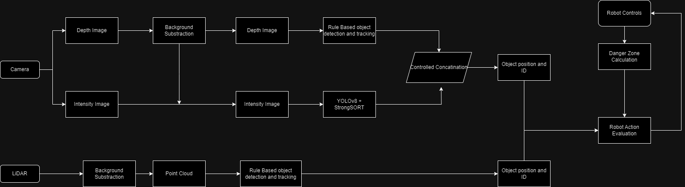

# HRC
Concept Human Robot Collaboration with Camera-Lidar Fusion

### Status: In development
## Pipeline
Two parallel detections from Camera and Lidar for dynamic human detection and tracking. Camera outputs depth and intensity images and the LiDAR gives us a point cloud. The idea is to set up a simulated environment in NVIDIA Isaac Sim and obtain data for testing in realtime environment.

### Camera
- Depth images are used for background substraction and a rule based object detection and tracking is used.
- Intensity images (after background substraction) are used for object detection and tracking using pretrained models (YOLOv8+StrongSORT).

### LiDAR
- Rule based object detection and tracking used on point cloud.(Using AI can be computaionally expensive)

### Robot
- Pick and place robot with dynamic danger zone calculation based on x-y projection of robot arm

